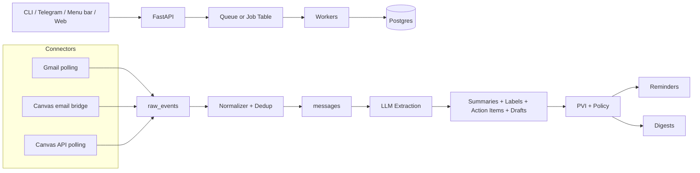
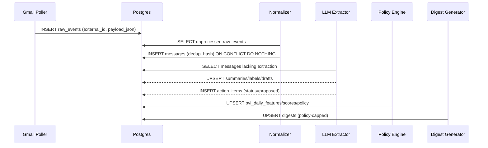
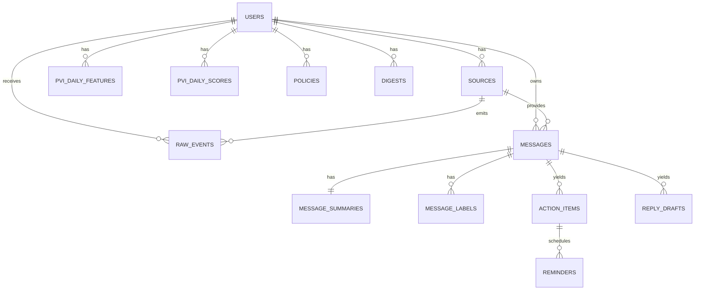
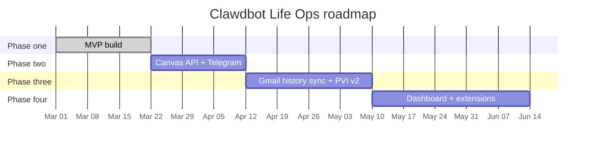

# Clawdbot Life Ops and Personal Volatility Index

[Download `claude.md`](sandbox:/mnt/data/claude.md)

## Executive summary

Clawdbot Life Ops is a personal “life ops” system that ingests high‑signal updates (starting with Gmail and Canvas), summarizes them, extracts action items, and converts them into tasks, reminders, and a daily digest. The Personal Volatility Index (PVI) is a daily “load + capacity” model that adapts how much the system surfaces and how aggressively it nudges, to avoid notification fatigue.

This project package is designed around two official integration sources:

- Gmail ingestion using the Gmail API’s documented sync model (full sync + lighter partial sync using `history.list` and a stored `historyId` cursor, with the documented HTTP 404 fallback to full sync). citeturn11view0turn15view0  
- Canvas ingestion starting as a Phase one “email bridge” (parsing Canvas emails inside Gmail), with a Phase two plan to add direct Canvas REST API polling via OAuth2 endpoints and resources documented by entity["company","Instructure","canvas lms vendor"]. citeturn9view3turn8view0turn13view0turn12view0

Phase one prioritizes reliability and replayability:

- Poll-based Gmail ingestion is used first, consistent with Gmail docs that polling remains recommended for user-owned devices, while push notifications via Pub/Sub are oriented around backend server applications. citeturn5view2turn10view2  
- An event-sourced pipeline stores immutable `raw_events` so that normalization and LLM extraction can be replayed safely with new prompt versions.

### Phase one checklist

- [ ] Scaffold monorepo with the exact repo layout (API + worker + shared packages + connectors + CLI + infra)
- [ ] Implement docker-compose for Postgres (+ optional Redis if using RQ)
- [ ] Implement Postgres schema + Alembic migrations (tables, indexes, constraints)
- [ ] Implement secure token storage abstraction (OS keychain locally; encrypted store for cloud)
- [ ] Implement Gmail OAuth installed-app flow with PKCE and local redirect URI handling citeturn16view1turn16view3
- [ ] Implement Gmail polling connector using `users.messages.list` + `users.messages.get` (metadata/full configurable) citeturn5view0turn10view3
- [ ] Implement Canvas email-bridge parser (detect Canvas messages, extract course/assignment/due/link)
- [ ] Implement replayable pipeline: `raw_events → messages → LLM extraction → tasks/reminders/digests`
- [ ] Implement strict schema-validated LLM extraction (Pydantic `extra="forbid"` + one repair retry)
- [ ] Implement tasks lifecycle (proposed/active/done/dismissed) and reminders scheduling rows
- [ ] Implement daily digest generator (policy-capped) and `claw digest today`
- [ ] Implement PVI v1: daily features → score → regime → policy snapshot + `claw pvi today`
- [ ] Implement idempotency (DB-level uniqueness) + replay commands (re-extract, re-digest)
- [ ] Implement unit tests (dedup hashing, parser fixtures, PVI, policy mapping, schema validation)
- [ ] Implement structured logging + minimal metrics counters (ingest/extract/queue health)

## Functionality and user experience

This section enumerates every user-facing and backend capability in the Gmail + Canvas MVP and describes exactly how each behaves.

### User-facing functionality

The system has four core experiences: unified inbox, tasks, digest, reminders.

The canonical user timezone for all due-date decisions is `Asia/Singapore` (mapped to entity["country","Singapore","city-state"]) unless configured otherwise.

**Unified inbox**  
The unified inbox is a *read-only* view over normalized “messages” across Gmail and Canvas. Each message has a canonical internal ID and a stable dedup fingerprint, so rerunning sync does not duplicate entries.

- `claw inbox` lists recent messages (default: last 50) with: source, sender, title/subject, timestamp, short summary (if processed), flags (`action_required`, `due_soon`).
- `claw inbox show <message_id>` shows: metadata, long summary, extracted tasks (proposed), and optional reply drafts.
- `claw inbox search "<query>"` searches by sender/title/summary text (Phase one: DB `ILIKE`; Phase four: embeddings).

**Daily digest**  
The digest is a markdown report generated once per day (or on demand) and capped/structured by policy derived from today’s PVI.

- `claw digest today` renders: Do today (≤24h), Upcoming (≤7d), Updates (announcements/admin info), Reply queue (optional).
- Digest size is capped by policy `max_digest_items`. In Overloaded/Recovery regimes, the digest is intentionally shorter.

**Tasks lifecycle**  
Default is “propose-only” so the system never silently creates active obligations.

- LLM-extracted action items create `proposed` tasks.
- `claw tasks accept <task_id>` promotes to `active`.
- `claw tasks done <task_id>` marks complete; reminders cancel.
- `claw tasks dismiss <task_id>` removes it from digests/reminders.
- `claw tasks edit <task_id> --due ... --priority ...` applies manual overrides.

**Reminders**  
Reminders are always stored as DB rows (even if Phase one delivery is only CLI/log); this is important for audit and replay.

- Policy defines cadence:
  - gentle: {T-24h, T-4h}
  - standard: {T-48h, T-24h, T-4h}
  - aggressive: {T-72h, T-48h, T-24h, T-8h, T-4h}
- `claw snooze <task_id> <hours>` shifts the next pending reminder for that task by the requested duration.
- Phase one delivery: CLI (`claw reminders due`) and logs.
- Phase two delivery: push reminders via entity["company","Telegram","messaging platform"].

**Reply drafts**  
The system can generate reply drafts, but never sends mail automatically.

- `claw inbox draft <message_id> --tone concise|neutral|formal` prints a draft.
- Drafts are stored as `proposed`; sending remains out of scope for Phase one.

### Backend functionality

The backend is an explicit pipeline over an append-only raw log:

- Connectors write immutable `raw_events`.
- Deterministic normalization creates canonical `messages` (deduped).
- LLM extraction writes strictly validated summaries/labels/tasks/drafts.
- PVI computation writes a daily score + policy snapshot.
- Digest and reminders are derived from tasks/messages and policy.

This pipeline structure is chosen specifically to support replay and incremental sync strategies described by the Gmail documentation (store a `historyId` cursor for partial sync via the History API). citeturn11view0turn15view0

### Device deployment models and tradeoffs

| Model | Data location | Token location | LLM execution | Best for | Key risks | Practical notes |
|---|---|---|---|---|---|---|
| Local-only | local Postgres + local files | OS keychain/credential store | local LLM / cloud LLM / disabled | single-user personal daily driver | local machine compromise | easiest privacy posture; matches polling-first recommendation for user-owned devices citeturn5view2turn5view5 |
| Cloud | managed Postgres + object store | encrypted secret store (KMS) | cloud LLM | always-on reminders, multi-device | centralized breach risk; higher security burden | push notifications via Pub/Sub naturally fit server deployments citeturn5view2turn10view0 |
| Hybrid | metadata in cloud; bodies local | split | hybrid | balance privacy + always-on | complexity; sync bugs | requires careful “fetch body on demand” design |

### UX surfaces

- CLI (Phase one): authoritative surface for inbox/tasks/digest/PVI/replay.
- Menu bar (Phase three): thin client reading today’s digest and top tasks; quick accept/done/snooze.
- Telegram bot (Phase two): delivery surface for reminders and quick actions; quiet hours governed by policy.
- Web dashboard (Phase four): audit + settings + replay console, including prompt versions and extraction evidence.

## Architecture and execution model

### ASCII architecture diagram

```text
+----------------------------+        +---------------------------+
| CLI / Bot / Menu / Web    | <----> | FastAPI (localhost / API) |
+-------------+--------------+        +-------------+-------------+
              |                                   |
              v                                   v
      +---------------+                     +-------------+
      | Scheduler     |                     | Job Queue   |
      | (cron/APS)    |                     | (RQ or DB)  |
      +-------+-------+                     +------+------+
              |                                    |
              v                                    v
+----------------------------+          +--------------------------+
| Connectors                 |          | Workers                  |
| - Gmail poll               |  events   | - normalize & dedup      |
| - Canvas email bridge      +---------> | - LLM extract            |
| - later: Canvas API poll   |          | - tasks/reminders/digest  |
+----------------------------+          +-----------+--------------+
                                                     |
                                                     v
                                           +-----------------------+
                                           | Postgres              |
                                           | raw_events/messages/  |
                                           | tasks/pvi/policies    |
                                           +-----------------------+
```

### Mermaid architecture diagram



### Event flow and sequence diagram

Event-progression is represented by DB state transitions and unique constraints, enabling replay:

- `raw_events` inserted by connector
- `messages` inserted by normalizer (dedup enforced)
- `message_summaries/labels/reply_drafts/action_items` inserted by extractor
- `pvi_daily_*` and `policies` computed daily
- `digests` built daily; `reminders` scheduled and dispatched



### Background jobs and semantics

| Job | Trigger | Input | Idempotency key | Writes | Failure behavior |
|---|---|---|---|---|---|
| poll_gmail | every N minutes | source_id | raw unique constraints | raw_events | exponential backoff |
| normalize_raw_events | continuous | raw_event_id | raw_events.id | messages | mark processed or error |
| llm_extract_message | continuous | message_id + prompt_version | (message_id, prompt_version) | summaries/tasks/drafts | retry once on invalid JSON |
| compute_pvi_daily | daily | user_id + date | (user_id, date) | features/scores/policy | safe upsert |
| schedule_reminders | daily + on accept | task_id | unique reminder constraint | reminders | safe rerun |
| generate_digest | daily + on demand | user_id + date | unique digest constraint | digests | rebuild allowed |
| dispatch_reminders | every minute | now | reminder id | reminders status | at-least-once + dedup |

### Idempotency and replay strategies

The replay design is informed by Gmail’s official sync model:

- Full sync uses `messages.list` then batched `messages.get`, caching content; subsequent refreshes can use smaller formats when only labels might change. citeturn11view0  
- Partial sync calls `history.list` with `startHistoryId`; out-of-range cursors typically yield HTTP 404, and the recommended response is to perform a full sync. citeturn15view0turn11view0  

Practical replay modes:
- Re-normalize: rebuild `messages` from immutable `raw_events`.
- Re-extract: rerun LLM extraction for selected messages with a new prompt_version.
- Re-digest: regenerate digests for a date range from tasks/messages and policy snapshots.

## Data model and interfaces

### Mermaid ER diagram



### Database schema

The schema is designed to support:
- ingestion replay (raw_events immutable),
- auditability (prompt_version/model stored),
- fast “what’s due” queries (task/reminder indexes),
- strict idempotency (unique constraints).

A key Gmail-specific operational detail: the Labels resource includes unread metrics (`messagesUnread`, `threadsUnread`) and system label behavior (e.g., INBOX and UNREAD). This supports PVI features like inbox_unread without scanning all messages. citeturn4view0

The complete table/field/index reference and full DDL skeleton are included in the downloadable `claude.md`.

### FastAPI endpoints

Phase one is localhost-only by default; endpoints exist to enable later UI surfaces.

- `POST /v1/sync/run`
- `GET /v1/inbox`
- `GET /v1/inbox/{message_id}`
- `GET /v1/tasks?status=`
- `POST /v1/tasks/{task_id}/accept|done|dismiss`
- `POST /v1/tasks/{task_id}/snooze`
- `GET /v1/digest/today`
- `GET /v1/pvi/today`
- `POST /v1/replay/extract`
- `POST /v1/replay/digest`

### CLI commands

- `claw init`
- `claw connect gmail`
- `claw sync`
- `claw inbox`
- `claw inbox show <message_id>`
- `claw inbox draft <message_id> --tone concise|neutral|formal`
- `claw tasks [--status proposed|active|done|dismissed]`
- `claw tasks accept|done|dismiss <task_id>`
- `claw snooze <task_id> <hours>`
- `claw digest today`
- `claw pvi today`
- `claw replay extract --prompt-version v2 --since YYYY-MM-DD`

## Integrations for Gmail and Canvas

This section provides exact endpoints, parameters, and OAuth flows grounded in official documentation.

### Gmail connector

**Required endpoints and parameters**

- List messages: `users.messages.list` supports `maxResults`, `pageToken`, `q`, `labelIds[]`, `includeSpamTrash`; response includes message IDs plus `nextPageToken` and result estimates. citeturn5view0  
- Get message: `users.messages.get` supports `format` (and `metadataHeaders[]` when `format=METADATA`) and enumerates valid authorization scopes for access. citeturn10view3  
- Format semantics: Gmail documents formats including `raw` and `metadata`, and notes `raw` cannot be used with the `gmail.metadata` scope (and the sync guide recommends FULL/RAW initially, and MINIMAL for cached messages when only labels may change). citeturn1search5turn11view0  
- Profile cursor: `users.getProfile` returns a mailbox-wide `historyId` cursor. citeturn15view1  
- History incremental sync: `users.history.list` requires `startHistoryId`, documents non-contiguous history IDs, and notes that invalid/out-of-date cursors typically return HTTP 404 and should trigger a full sync. citeturn15view0  

**OAuth installed-app flow and secure storage**

The installed-app OAuth guidance includes:
- PKCE support for installed apps, with explicit code verifier/challenge definitions and the recommendation to use S256. citeturn16view1turn16view0  
- Installed apps should open a system browser and use a local redirect URI for the authorization response. citeturn16view3  
- Access tokens are sent in the Authorization header (`Authorization: Bearer ...`) or as query parameters; example shows header use as preferred. citeturn16view2  

Token handling best practices:
- OAuth best practices recommend storing user tokens securely at rest using platform secure storage (Keychain/Keystore/Credential Locker), encrypting tokens at rest for server-side apps, and revoking tokens when no longer needed. citeturn5view5  

**Polling vs history sync vs push notifications**

- Polling is the Phase one default, consistent with Gmail push guidance that polling remains recommended for notifications to user-owned devices, while push notifications notify backend server applications. citeturn5view2  
- Push notifications via Pub/Sub require topic setup, granting publish rights to Gmail’s push service account, and then calling `users.watch`; docs provide a watch request example and note `historyId` and `expiration` in the response. citeturn5view2turn10view2turn10view0  
- `users.watch` explicitly documents `topicName`, label filtering behavior, and that `expiration` is epoch millis and requires renewing watch before expiry. citeturn10view0  

Operational constraints:
- Gmail publishes per-project and per-user quota unit limits; implement backoff and avoid aggressive polling. citeturn1search3  

### Canvas connector

Phase one uses an email bridge; Phase two uses OAuth2 + REST polling.

**Canvas OAuth2 and token security**

Canvas OAuth overview and endpoints specify:
- OAuth endpoints include `GET login/oauth2/auth`, `POST login/oauth2/token`, `DELETE login/oauth2/token`, `GET login/session_token`. citeturn9view3turn6view2  
- Token exchange uses `grant_type=authorization_code` plus `client_id`, `client_secret`, `redirect_uri`, and the code; the code is invalidated after use. citeturn9view1turn14search3  
- Access tokens have a 1-hour lifespan; refresh yields a new access token and reuses the same refresh token (no new refresh token returned). citeturn6view3turn17view3  
- Token storage guidance: tokens are password-equivalent; do not embed tokens in web pages or pass them in URLs; secure token stores; for native apps use OS keychains; use Authorization header; query-string tokens are discouraged due to logging/leak risk. citeturn17view0turn17view1turn9view1  
- Token revocation via `DELETE /login/oauth2/token`, with optional `expire_sessions`. citeturn9view2  

**Canvas resources for Phase two polling**

- List courses: `GET /api/v1/courses` returns paginated active courses and supports parameters such as enrollment filters and `include[]`. citeturn8view0  
- List assignments: `GET /api/v1/courses/:course_id/assignments`, with useful parameters including `bucket` (upcoming/overdue/etc.) and `order_by` (including `due_at`). citeturn6view0turn13view0  
- List announcements: `GET /api/v1/announcements` requires `context_codes[]` and supports date parameters `start_date` and `end_date` with documented defaults and permission constraints. citeturn12view0  
- Pagination: default 10 items, use `per_page`, and follow opaque `Link` header URLs for navigation; if you authenticate via access_token query param, it is not included in returned links and must be re-appended. citeturn9view0  

## LLM extraction and policy intelligence

### LLM JSON schema and validation

The LLM is used only via a strict JSON contract that is validated before writing to DB; “extra keys” are forbidden to prevent silent schema drift. The downloadable `claude.md` contains the full Pydantic v2 validators and schema.

Example output JSON:

```json
{
  "labels": [
    {"label": "coursework", "confidence": 0.93},
    {"label": "action_required", "confidence": 0.77}
  ],
  "summary_short": "Assignment 4 due Monday 23:59; submit via Canvas.",
  "summary_long": "Canvas notification indicating due date/time and submission details.",
  "action_items": [
    {
      "title": "Submit Assignment 4",
      "details": "Upload PDF to Canvas assignment page.",
      "due_at": "2026-03-09T23:59:00+08:00",
      "priority": 86,
      "confidence": 0.74
    }
  ],
  "reply_drafts": [],
  "urgency": 0.81,
  "evidence": {
    "due_date_evidence": "Email text contains 'Due: Mar 9 23:59'",
    "source_url": "https://<canvas>/courses/123/assignments/456"
  }
}
```

Prompt templates are built to reflect the key privacy levers:
- metadata-only mode uses `format=METADATA` and may require narrower scopes; full-body mode uses FULL/RAW on first fetch and caches, consistent with Gmail sync guidance. citeturn11view0turn1search5turn10view3  

### Personal Volatility Index

Phase one PVI is intentionally rule-based and explainable.

**Feature definitions**
- tasks_open: count of tasks in proposed or active
- tasks_overdue: active tasks with due_at < now
- inbox_unread: unread estimate derived from Gmail label unread counts (`messagesUnread`, `threadsUnread`) citeturn4view0  
- incoming_24h: new normalized messages in last 24 hours
- calendar_minutes: placeholder 0 in Phase one

**Rule-based scoring**  
Deterministic score and a short explanation string are both stored:

- score starts at 50
- add up to 25 points for overdue tasks
- add points for large unread and high incoming count
- subtract points when the system is demonstrably calm

**Regime classifier and policy mapping**
- regimes: peak / normal / overloaded / recovery
- policy mapping expressed as `max_digest_items`, escalation level, reminder cadence, and whether to auto-activate tasks.

Sample digest output:

```text
Clawdbot Digest — 2026-03-01 (Policy: normal, max 15)

DO TODAY
- [ ] Submit Assignment 4 (due 2026-03-01 23:59) [priority 86; conf 0.74]

UPCOMING
- [ ] Prepare for quiz (due 2026-03-04 09:00) [priority 70; conf 0.62]

UPDATES
- Canvas announcement: Venue changed (posted today)

PVI
- Score 56 (normal)
- Drivers: inbox_unread=28, tasks_overdue=0, incoming_24h=22
```

## Security, compliance, testing, deployment, and observability

### Security model

Security design follows the principle that access tokens and refresh tokens are secret material.

Token handling:
- Google OAuth best practices recommend secure token storage at rest using OS secure stores (Keychain/Keystore/Credential Locker), encrypting tokens at rest for server-side apps, and revoking tokens when no longer needed. citeturn5view5  
- Canvas OAuth docs explicitly state tokens are password-equivalent, advise against embedding tokens in web pages or passing them in URLs, and recommend native app keychain storage; they recommend Authorization header usage and discourage query-string token transmission. citeturn17view0turn17view1turn9view1  

Phase one auth boundary:
- FastAPI binds to localhost.
- CLI is the primary UX (trusted local user).
- No remote exposure by default.

### GDPR-oriented considerations

If you expand beyond single-user personal use, GDPR-style design principles provide a helpful framework:

- GDPR Article 32 references measures including pseudonymisation and encryption as part of “security of processing.” citeturn2search0  
- Storage limitation: personal data should be kept no longer than necessary; the entity["organization","Information Commissioner's Office","uk data protection regulator"] summarizes the storage limitation principle and its retention implications. citeturn2search1  
- Right to erasure: individuals can have personal data erased under certain circumstances (UK GDPR Article 17 summarized by the ICO). citeturn2search2  
- Data minimization is articulated in GDPR and summarized by the entity["organization","European Data Protection Supervisor","eu data protection authority"] glossary: personal data must be adequate, relevant, and limited to what is necessary for the purpose. citeturn2search3turn2search17  

Design implications for later phases:
- retention windows for raw_events and full bodies
- privacy mode (store only metadata/snippets)
- export and delete tooling
- encryption for sensitive columns and strict access control

### Testing plan

Unit tests:
- dedup hashing stability
- Canvas email parser fixtures (≥5 variants)
- PVI scoring + regime classification + policy mapping
- Pydantic validation + retry-on-invalid logic
- reminder scheduling idempotency

Integration tests:
- end-to-end pipeline using fixture raw_events into tasks/digest (with fake LLM)
- migrations apply cleanly from scratch

### Observability and metrics

- structured logs with correlation IDs: user_id, source_id, raw_event_id, message_id, task_id, prompt_version
- counters: ingestion counts, extraction failures, tasks created, reminders scheduled/sent
- histograms: LLM latency, job latency
- gauges: queue depth, unprocessed raw_events backlog

### Deployment

- docker-compose: Postgres + API + worker (+ optional Redis)
- implement backoff to respect Gmail quota unit limits and per-user/per-project rate limits. citeturn1search3  

## Roadmap, sources, and implementation prompt

### Phased roadmap

Phase one deliverables:
- Gmail polling ingestion + Canvas email bridge parsing
- raw_events store, normalization, dedup
- schema-validated LLM extraction
- tasks/reminders/digest generation
- PVI v1 + policy engine
- replay tooling
- docker-compose + migrations + tests

Phase two deliverables:
- Canvas OAuth2 + polling courses/assignments/announcements using documented endpoints and pagination behavior. citeturn8view0turn13view0turn12view0turn9view0  
- Telegram bot delivery + quiet hours
- retention/purge tooling and deletion/export controls

Phase three deliverables:
- Gmail History API incremental sync with 404 fallback to full sync. citeturn15view0turn11view0  
- optional Pub/Sub-based push notifications (`users.watch`) for cloud mode, including watch renewal before expiration. citeturn10view0turn10view2  
- PVI v2 with smoothing and velocity

Phase four deliverables:
- web dashboard + replay console
- extension framework for additional sources

### Mermaid timeline



### Primary sources

Gmail API sync and methods:
- Sync guide (full sync, caching guidance, partial sync via history, 404 fallback) citeturn11view0  
- messages.list parameters and response behavior citeturn5view0  
- messages.get parameters, formats, scopes citeturn10view3  
- history.list required startHistoryId and 404/full-sync behavior citeturn15view0  
- getProfile historyId cursor citeturn15view1  
- push notifications overview and Pub/Sub steps citeturn5view2turn10view2  
- users.watch request/response and expiration renewal guidance citeturn10view0  
- Gmail quotas citeturn1search3  

OAuth:
- Installed app OAuth with PKCE and local redirect URI behavior citeturn16view1turn16view3turn16view0  
- Token storage and revocation best practices citeturn5view5  

Canvas OAuth and resources:
- OAuth endpoints and parameter contract citeturn9view3turn9view1  
- Token storage as password-equivalent; header recommended; query-string discouraged; keychain guidance citeturn17view0turn17view1turn9view1  
- Courses list endpoint and parameters citeturn8view0  
- Assignments list endpoint parameters bucket/order_by citeturn13view0turn6view0  
- Announcements endpoint parameters context_codes/start_date/end_date and defaults citeturn12view0  
- Pagination rules and Link header behavior citeturn9view0  

Data protection:
- GDPR security of processing (Article 32) citeturn2search0  
- Storage limitation principle guidance (ICO) citeturn2search1  
- Right to erasure guidance (ICO) citeturn2search2  
- Data minimization definition (EDPS and ICO) citeturn2search3turn2search17  

### Prioritized improvements and research questions

Prioritized improvements:
- Replace Canvas email heuristics with Canvas API polling for canonical due dates and announcements. citeturn8view0turn13view0turn12view0  
- Implement Gmail History API incremental sync to reduce polling cost and improve correctness, including 404 fallback to full sync. citeturn15view0turn11view0  
- Add Telegram reminder delivery + quick actions.
- Add deterministic due-date parsing (regex/locale rules) and use LLM only as verifier.
- Add replay console showing prompt versions and evidence, to build trust and speed debugging.

Research questions:
- What minimum message content yields reliable task extraction (metadata-only vs full-body), given format/scope constraints? citeturn1search5turn10view3turn11view0  
- What policy mapping minimizes notification fatigue without increasing misses?
- What robust heuristics identify Canvas emails across institutions (before API integration)?
- Which additional signals best predict overload (calendar load, backlog age, response latency)?

### Claude Code super-prompt

```text
You are a senior product engineer and architect. Build an MVP called “Clawdbot Life Ops + Personal Volatility Index (PVI)” in a monorepo.

CRITICAL OUTCOME
Deliver a working Phase one MVP that (1) syncs Gmail, (2) parses Canvas notifications via Gmail email-bridge, (3) stores raw events and normalized messages in Postgres, (4) runs schema-validated LLM extraction to generate summaries/tasks/drafts, (5) computes PVI and policy daily, and (6) generates a policy-capped daily digest. Provide docker-compose, migrations, CLI, tests, and docs.

FIRST OUTPUT
Before coding, output:
1) Architecture diagram (ASCII)
2) DB schema: tables + fields + indexes + unique constraints + rationale
3) Data flow + job list + idempotency plan
Only after those are complete, start implementing code.

SCOPE
- Gmail ingestion via polling using Gmail API: users.messages.list + users.messages.get
- Canvas ingestion via “email bridge” parsing of Canvas emails already in Gmail
- Store everything in Postgres; replayable pipeline from raw_events
- Reminders exist as DB rows and CLI-visible; no push delivery required
- No auto-sending emails; drafts only
- CLI is primary UX; FastAPI endpoints exist for future

TECH STACK (enforce)
- Python 3.11
- FastAPI (apps/api)
- Postgres (docker-compose)
- Alembic migrations
- Background jobs: choose ONE:
  (A) Redis + RQ, OR
  (B) Postgres job table + APScheduler
Prefer the simplest that works reliably.
- Pydantic v2 models for schema validation of LLM outputs (extra=forbid)
- Structured logging (JSON logs) with correlation IDs

EXACT REPO STRUCTURE
apps/
  api/                 # FastAPI server (HTTP endpoints)
  worker/              # scheduler + workers (jobs)
packages/
  core/                # db models, pydantic schemas, pvi, policy, llm interface
  connectors/          # gmail connector + canvas email-bridge parser
  cli/                 # “claw” CLI
infra/
  docker-compose.yml
  alembic/             # migrations
  scripts/             # seed/demo scripts
tests/
  unit/
  integration/

CORE DB TABLES (must implement, with indexes)
users, sources, raw_events, messages,
message_summaries, message_labels, reply_drafts,
action_items, reminders,
pvi_daily_features, pvi_daily_scores, policies,
digests

CONNECTORS
Gmail connector:
- Implement OAuth installed-app flow with PKCE and local redirect
- Poll messages using users.messages.list with labelIds and/or q
- Fetch details using users.messages.get; support format=metadata vs full based on privacy config
- Store raw payload in raw_events with external_id = gmail message id
- Store unread estimates from Labels resource (messagesUnread/threadsUnread)

Canvas email bridge:
- Identify Canvas-related emails by heuristics (sender/subject/body markers)
- Extract course name/code, assignment title, due date, and URL if present
- Store parsed fields in messages.extra_json

PIPELINE
- raw_events -> messages normalization:
  - compute dedup_hash and enforce unique (user_id, dedup_hash)
  - ensure rerunning sync does not duplicate messages
- LLM extraction:
  - produce strict JSON including labels, summaries, action_items, reply_drafts, urgency, evidence
  - validate with Pydantic (extra=forbid)
  - if invalid JSON: retry once with a repair prompt; then mark extraction_failed and continue
- Task creation:
  - create proposed tasks from action_items
- Reminders:
  - schedule reminders for due_at tasks based on policy; store reminders rows
- Digest:
  - generate markdown digest capped by policy.max_digest_items; store digests row
- PVI:
  - daily job computes features -> score -> regime -> policy; store in DB

CLI COMMANDS
- claw init
- claw connect gmail
- claw sync
- claw inbox
- claw inbox show <message_id>
- claw inbox draft <message_id> --tone concise|neutral|formal
- claw tasks [--status ...]
- claw tasks accept|done|dismiss <task_id>
- claw snooze <task_id> <hours>
- claw digest today
- claw pvi today
- claw replay extract --prompt-version v2 --since YYYY-MM-DD
- claw replay digest --since YYYY-MM-DD --until YYYY-MM-DD

FASTAPI ENDPOINTS (Phase one)
- POST /v1/sync/run
- GET /v1/inbox
- GET /v1/inbox/{message_id}
- GET /v1/tasks
- POST /v1/tasks/{task_id}/accept|done|dismiss
- POST /v1/tasks/{task_id}/snooze
- GET /v1/digest/today
- GET /v1/pvi/today
- POST /v1/replay/extract
- POST /v1/replay/digest

SECURITY
- Bind API to localhost by default
- Token storage abstraction: use keyring if available; never log tokens
- Configurable privacy.store_full_bodies boolean

UNIT TEST TARGETS
- dedup hashing stability
- canvas email parsing fixtures (at least 5 variants)
- pvi scoring + regime classification
- policy mapping
- pydantic schema validation and retry behavior
- reminder scheduling idempotency

COMMANDS TO RUN (document in README)
- docker-compose up -d
- alembic upgrade head
- python -m packages.cli.claw init
- python -m packages.cli.claw connect gmail
- python -m packages.cli.claw sync
- python -m packages.cli.claw digest today

Now begin:
1) output the architecture diagram, DB schema, data flow + job list;
2) then implement Phase one MVP end-to-end.
```