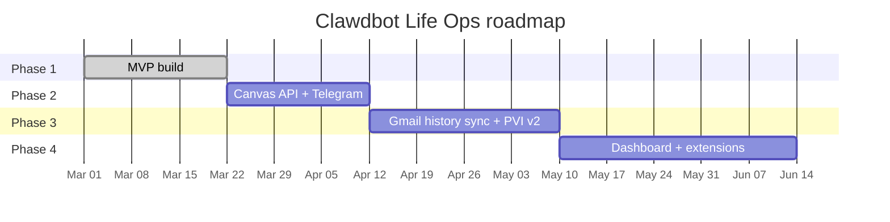
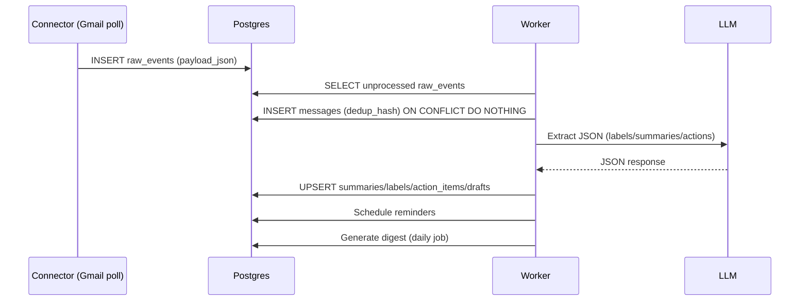

# Clawdbot Life Ops + Personal Volatility Index (PVI)

[Download `claude.md`](sandbox:/mnt/data/claude.md)

## Executive summary

Clawdbot Life Ops is a personal operations system that ingests high‑signal updates (starting with Gmail and Canvas), summarizes them, extracts action items, and turns them into tasks/reminders plus a daily digest. The Personal Volatility Index (PVI) is a lightweight “state and load” model that decides:

- how much information to show you per day (digest compression),
- how aggressively to remind/escalate,
- what to defer vs surface now.

The MVP is intentionally narrow: **Gmail ingestion** + **Canvas ingestion** (via email bridge first), **tasks/reminders**, **daily digest**, **rule-based PVI**, and **replayable pipelines**. The ingestion design is grounded in Gmail’s recommended sync patterns (full sync + history-based partial sync) and its guidance that polling remains recommended for installed/user-owned devices, while push notifications are delivered via Pub/Sub and are most natural for backend servers. citeturn7view0turn5view0turn5view1

## Complete functionality list

This section lists *every* user-facing and backend capability and exactly how it works. Scope is **Gmail + Canvas ingestion MVP**, with later sources explicitly marked.

### User-facing functionality

**Unified inbox (CLI-first)**  
- Command: `claw inbox`  
- Shows normalized items across sources, newest first.  
- Each row displays: source, sender, subject/title, timestamp, short summary (once processed), and an “action required” flag.  
- `claw inbox show <message_id>` shows long-form summary, extracted actions, and any suggested reply drafts.  
- In MVP, attachments are not downloaded or summarized; only metadata/snippets/body text are used (configurable).

**Daily digest**  
- Command: `claw digest today`  
- Produces a markdown digest with three sections:
  - “Do today” (due within 24h)
  - “Upcoming” (due within 7 days)
  - “Updates” (announcements/admin/info items ranked by urgency)
- Digest length is capped by the policy derived from PVI (e.g., overloaded → fewer items).  
- Optional later: scheduled delivery (morning/evening) via a Telegram bot or email-to-self.

**Task lifecycle (propose → accept → done)**  
- LLM-extracted action items are created as **Proposed** tasks by default.  
- Commands:
  - `claw tasks` (filterable by status)
  - `claw tasks accept <task_id>` (Proposed → Active)
  - `claw tasks done <task_id>` (Active → Done)
  - `claw tasks dismiss <task_id>` (Proposed/Active → Dismissed)
  - `claw tasks edit <task_id> --due ... --priority ...` (manual overrides beat model output)
- Optional later: auto-activate tasks when regime is Peak and confidence is high (policy controlled).

**Reminders**  
- Automatically scheduled for tasks with due dates.  
- Command: `claw snooze <task_id> <hours>` moves the next reminder.  
- Phase 1: reminders are emitted to logs/CLI (or stored only).  
- Phase 2: reminders can be sent via a Telegram bot (and later push notifications).

**Reply drafts (no auto-send in MVP)**  
- For actionable emails, the system can generate drafts (concise/neutral/formal).  
- Command: `claw inbox draft <message_id> --tone concise`  
- Drafts are stored with status `proposed`; the system never sends emails in Phase 1.

**Personal Volatility Index (PVI) visibility**  
- Command: `claw pvi today` prints a score (0–100), regime label, explanation, and policy snapshot.  
- Command: `claw pvi history --days 30` prints recent scores.

**Privacy controls (opt-in)**  
- `claw config set privacy.store_full_bodies false` stores only metadata/snippets and fetches bodies on-demand.  
- `claw config set privacy.redact_emails true` redacts email addresses in output/logs.  
- `claw config set llm.mode disabled` disables LLM calls (pipeline still stores and normalizes).

**Optional later UX surfaces**  
- **entity["company","Telegram","messaging platform company"] bot:** `/digest`, `/tasks`, `/done`, `/snooze`, push reminders.  
- Menu bar app (macOS): “top 3” view + one-click digest + quick accept/done/snooze.  
- Web dashboard: inbox, tasks, digest history, replay console, settings.

### Backend functionality

**Connectors**  
- Gmail connector:
  - Phase 1: poll-based sync (unread + recent).
  - Phase 3+: true incremental sync via Gmail History API and optional push notifications. citeturn7view0turn5view2turn5view1
- Canvas ingestion:
  - Phase 1: email bridge (parse Canvas notifications inside Gmail).
  - Phase 2: OAuth2 + Canvas REST API polling (assignments + announcements). citeturn12view0turn13view1turn15view0

**Raw event storage (replay foundation)**  
- Every ingested item is stored as a `raw_events` row (payload JSON + metadata).  
- Derived tables are re-creatable from raw events (replay/regeneration model).

**Normalization**  
- Converts raw events into `messages` using a unified schema.  
- Normalization is deterministic and versioned (optionally store `normalizer_version`).

**Deduplication**  
- Per-user stable `dedup_hash` is computed.  
- Idempotency relies on unique indexes, not “best effort” checks.

**LLM extraction pipeline**  
- Produces strictly validated JSON output:
  - labels, summaries, action items, reply drafts, urgency score.
- Retries once on invalid JSON, then marks extraction_failed.

**Task/reminder engine**  
- Writes tasks to `action_items`.  
- Computes reminders from due dates and policy; schedules into `reminders`.

**PVI engine**  
- Daily job computes features → score → regime → policy.  
- Policy controls: digest cap, escalation, reminder cadence, and auto-activation.

**Digest generator**  
- Builds digest markdown and writes to `digests`.  
- Can render to terminal and later deliver via bot/email.

**Replay utilities**  
- Re-run normalization from raw events.  
- Re-run LLM extraction with a new `prompt_version`.  
- Re-generate digests for any date range.

## Deployment, UX surfaces, and privacy model

This system can run as **local-only**, **cloud-only**, or **hybrid**.

| Deployment model | Where data lives | Where tokens live | LLM execution | Pros | Cons | Recommended for |
|---|---|---|---|---|---|---|
| Local-only | Your machine (local Postgres or SQLite) | OS keychain (preferred) | cloud LLM / local LLM / disabled | Best privacy posture by default; simplest for personal use | Always-on reminders and push notifications are harder | Phase 1 default |
| Cloud-only | Server (managed Postgres) | Server encrypted store | cloud LLM | Always-on; easiest bot/web; enables Pub/Sub-based Gmail push | Highest privacy/security burden; data is centralized | Multi-device, always-on |
| Hybrid | Split (minimal in cloud; content local) | split | hybrid | Balance privacy and availability | Highest complexity | Later phase |

**Security/privacy tradeoffs**  
- Gmail push notifications are delivered using Cloud Pub/Sub and require a backend endpoint to receive notifications; Google also notes that for installed/user-owned device notifications, polling-based sync is still the recommended approach. citeturn5view0turn5view1  
- API access tokens should generally be sent using Authorization headers rather than query strings because query strings can end up in logs; this guidance is explicitly stated in Google’s OAuth documentation. citeturn17view0turn9view1  
- Canvas API access is over HTTPS and uses OAuth2; Canvas recommends using the Authorization header when possible and warns that sending credentials over HTTP risks cleartext exposure before redirect. citeturn13view0  
- External LLM calls are the biggest privacy lever. The design supports metadata-only processing, on-demand body fetching, PII redaction, and retention windows (privacy-by-default posture aligns with data minimization and storage limitation concepts commonly used in data protection practice). citeturn10search7turn10search14

**UX surfaces**  
- Phase 1: CLI (complete coverage).  
- Phase 2: Telegram bot (high leverage for reminders).  
- Phase 3: menu bar app (ambient awareness).  
- Phase 4: web dashboard (settings, history, replay).

## Goals, non-goals, and roadmap

### Goals

- Make “important things” hard to miss without turning into a nagging system.
- Turn unstructured messages (email / LMS notifications) into *actionable* tasks and reminders.
- Provide a digest that adapts to your state (PVI-driven).
- Ensure reliability via idempotency and replay (debuggable pipelines).

### Non-goals

- Full email client replacement.
- Auto-sending emails or auto-submitting assignments.
- Attachment ingestion (PDF parsing) and OCR in the MVP.
- Multi-user SaaS in early phases.
- Perfect Canvas email parsing (it’s inherently institution-specific; Phase 2 reduces reliance).

### Roadmap overview

**Phase 1 (MVP): Gmail + Canvas email bridge + PVI policy**  
- CLI-first end-to-end pipeline.  
- Reminders stored/logged (optional CLI output).  
- Digest generation.  
- Rule-based PVI + policy.

**Phase 2: Canvas API + Telegram bot**  
- Canvas OAuth2 integration and polling via documented endpoints. citeturn12view0turn13view0  
- Telegram reminders and quick task actions.  
- Better due date parsing (regex + LLM verification).

**Phase 3: Gmail incremental sync + optional push**  
- Gmail History API partial sync; full-sync fallback when the history cursor is outside the available range (Gmail documents HTTP 404 behavior when `startHistoryId` is out of date). citeturn7view0turn5view2  
- Optional Gmail push notifications for cloud mode (watch + renew before expiration). citeturn5view1turn5view0  
- PVI improvements (velocity, smoothing).

**Phase 4: Dashboard + replay console + extension ecosystem**  
- Web UI for settings + audit + replay.  
- Extension templates for new sources (Slack/Discord/Notion/GitHub).

### Phase one checklist

- [ ] Monorepo scaffold + docker-compose + Alembic wiring  
- [ ] Postgres schema + migrations (all core tables)  
- [ ] Gmail OAuth desktop flow + token storage abstraction (secure long-term storage for refresh tokens) citeturn9view0turn9view1  
- [ ] Gmail polling ingest: list messages + fetch details (metadata/full based on privacy setting) citeturn11view0turn11view2turn11view3  
- [ ] Canvas email bridge parser + fixtures  
- [ ] raw_events → messages normalization pipeline + dedup indexes  
- [ ] LLM extractor with strict JSON schema validation + retry-on-invalid  
- [ ] Tasks: proposed/active/done/dismiss + CLI flows  
- [ ] Reminder scheduling rows + snooze  
- [ ] Digest generation: today + date range  
- [ ] PVI daily job + policy mapping + CLI output  
- [ ] Replay commands: re-extract + re-digest  
- [ ] Unit tests + minimal integration tests  
- [ ] Observability: structured logs + basic metrics counters  

### Mermaid timeline



## Architecture, execution engine, and data flow

### ASCII architecture diagram

```text
+-------------------------+             +------------------------+
| CLI / Bot / Menu / Web  |  commands   | FastAPI (localhost/UI) |
+-----------+-------------+-----------> +-----------+------------+
            |                                     |
            |                                     v
            |                           +------------------------+
            |                           |  Job Queue / Scheduler |
            |                           +-----------+------------+
            |                                       |
            v                                       v
+-------------------------+                 +----------------------+
| Connectors              |                 | Workers              |
| - Gmail polling         |  raw payloads   | - normalize/dedup    |
| - Canvas email-bridge   +---------------> | - LLM extraction     |
| - (later) Canvas API    |                 | - tasks/reminders    |
+-------------------------+                 | - digest + PVI       |
                                            +-----------+----------+
                                                        |
                                                        v
                                              +----------------------+
                                              | Postgres             |
                                              | raw_events/messages/ |
                                              | tasks/pvi/digests    |
                                              +----------------------+
```

### Mermaid architecture diagram

```mermaid
flowchart LR
  UI[CLI / Telegram / Menu bar / Web] --> API[FastAPI API]
  API --> Q[Queue/Scheduler]
  Q --> W[Workers]
  W --> DB[(Postgres)]

  subgraph Connectors
    G[Gmail polling]
    CE[Canvas email bridge]
    CA[Canvas API (later)]
  end
  G --> RE[raw_events]
  CE --> RE
  CA --> RE
  RE --> N[Normalizer + Dedup]
  N --> M[messages]
  M --> L[LLM Extractor]
  L --> OUT[Summaries + Labels + Action Items + Drafts]
  OUT --> P[PVI + Policy Engine]
  P --> R[Reminders]
  P --> D[Digests]
  DB --- RE
  DB --- M
  DB --- OUT
  DB --- R
  DB --- D
```

### Mermaid sequence diagram



### Execution engine

Design principle: **event-sourced pipeline** with idempotent jobs (DB constraints are the source of truth for “already processed”).

**Core job types**
- Ingest:
  - `poll_gmail(source_id)`
  - `ingest_raw_event(raw_event_id)`
- Transform:
  - `normalize_message(raw_event_id)`
  - `llm_extract(message_id, prompt_version)`
- Act:
  - `build_tasks(message_id)`
  - `schedule_reminders(user_id, date)`
  - `dispatch_reminders(now)` (Phase 1: log only)
- Summarize:
  - `compute_pvi(user_id, date)`
  - `generate_digest(user_id, date)`

**Idempotency**  
- Gmail message listing returns message IDs (and thread IDs) and expects detail fetching via `users.messages.get`; that naturally supports idempotent ingestion keyed on `external_id` and/or a stable dedup hash. citeturn11view0turn11view1turn11view2  
- Gmail’s documented sync approach stores a `historyId` and uses `history.list` to perform partial sync; it also documents that history records are typically available at least a week and that an out-of-range history cursor yields HTTP 404 (triggering full sync). citeturn7view0turn5view2

**Replay**  
Replay is practical because raw payloads are persisted unmodified; derived data can be regenerated by versioned transforms (normalizer version, prompt version). This aligns well with Gmail’s incremental-update models (IDs/history cursors) and with Canvas’ well-defined API resources. citeturn7view0turn15view0turn13view1

## Data model, APIs, security, testing, and ops

### Database schema

The schema is “full enough” for production‑grade replay and auditing.

Core tables:
- `users`, `sources`, `raw_events`, `messages`

LLM-derived:
- `message_labels`, `message_summaries`, `reply_drafts`, optional `llm_runs`

Tasks:
- `action_items`, `reminders`

PVI:
- `pvi_daily_features`, `pvi_daily_scores`, `policies`

Digests:
- `digests`

Suggested indexes (beyond primary keys):
- `raw_events`: `(user_id, received_at desc)`, plus unique `(user_id, source_id, external_id)` when present
- `messages`: unique `(user_id, dedup_hash)` and `(user_id, message_ts desc)`
- `action_items`: `(user_id, status, due_at)` for “what’s due next”
- `reminders`: unique `(action_item_id, remind_at, channel)` and `(user_id, remind_at, status)`
- `digests`: unique `(user_id, date)`

### Example DDL snippet

```sql
CREATE TABLE messages (
  id uuid PRIMARY KEY,
  user_id uuid NOT NULL REFERENCES users(id),
  source_id uuid NOT NULL REFERENCES sources(id),
  external_id text,
  sender text NOT NULL,
  title text NOT NULL,
  body_preview text NOT NULL,
  message_ts timestamptz NOT NULL,
  ingested_at timestamptz NOT NULL DEFAULT now(),
  dedup_hash text NOT NULL,
  UNIQUE (user_id, dedup_hash)
);

CREATE INDEX idx_messages_user_ts ON messages(user_id, message_ts DESC);
```

### API endpoints

- `POST /v1/sync/run` — trigger a sync pass
- `GET /v1/inbox` — recent messages (with summaries)
- `GET /v1/inbox/{message_id}` — full detail
- `GET /v1/tasks?status=` — list tasks
- `POST /v1/tasks/{task_id}/accept`
- `POST /v1/tasks/{task_id}/done`
- `POST /v1/tasks/{task_id}/dismiss`
- `POST /v1/tasks/{task_id}/snooze` (body: hours)
- `GET /v1/digest/today`
- `GET /v1/pvi/today`
- `POST /v1/replay/extract` (message_ids + prompt_version)
- `POST /v1/replay/digest` (date range)

Phase 1 auth model:
- bind to localhost only,
- optional API token for local web UI,
- no remote exposure by default.

### CLI commands

- `claw init`
- `claw connect gmail`
- `claw sync`
- `claw inbox`
- `claw inbox show <message_id>`
- `claw inbox draft <message_id> --tone concise|neutral|formal`
- `claw tasks [--status proposed|active|done|dismissed]`
- `claw tasks accept <task_id>`
- `claw tasks done <task_id>`
- `claw tasks dismiss <task_id>`
- `claw snooze <task_id> <hours>`
- `claw digest today`
- `claw pvi today`
- `claw replay extract --prompt-version v2 --since 2026-02-01`

### Connector designs

**Gmail (Phase 1 polling)**  
- Use `users.messages.list` for IDs with label filters or Gmail search query syntax (the `q` parameter supports the same query format as the Gmail search box), then fetch details with `users.messages.get`. citeturn11view0turn11view2  
- Prefer metadata-first ingestion (`format=metadata`) when privacy mode is “store bodies off”; Gmail documents the available formats (`minimal`, `metadata`, `full`, `raw`). citeturn11view3  
- Plan for quotas and method-level quota costs; Gmail publishes per-user and per-project usage limits and per-method quota unit costs (notably `messages.list`, `messages.get`, `history.list`, `watch`). citeturn8view0

**Gmail (Phase 3 history-based incremental sync)**  
- Full sync: fetch IDs + batch get, store the latest `historyId`. Gmail describes full sync procedure and storing `historyId` for future partial sync. citeturn7view0  
- Partial sync: call `users.history.list` with `startHistoryId`; handle the documented HTTP 404 when `startHistoryId` is invalid/out of date by falling back to full sync. citeturn5view2turn7view0  
- Use `users.getProfile` for the mailbox profile and current `historyId` when you need a “current cursor” baseline. citeturn5view3

**Gmail push (optional, cloud mode)**  
- Gmail push uses Cloud Pub/Sub; you must create a topic + subscription and grant publish rights to Gmail’s system service account, then call `users.watch` with a fully qualified Pub/Sub topic name. citeturn5view0turn5view1  
- `users.watch` response includes `historyId` and `expiration` (epoch millis), and Gmail notes you must renew watch before expiration. citeturn5view1  
- Gmail explicitly notes that polling-based sync is still recommended for notifications to installed/user-owned devices. citeturn5view0

**Canvas (Phase 1 email bridge)**  
- Parse Canvas-related emails delivered to Gmail as the MVP ingestion path (institution-specific patterns).  
- Normalize extracted payload into canonical `messages` and let the LLM handle summarization/action extraction.

**Canvas (Phase 2 API)**  
- Canvas’ developer docs state API access is over HTTPS, responses are JSON, and API authentication is done with OAuth2; using the Authorization header is recommended. citeturn13view0  
- OAuth endpoints are documented: `GET /login/oauth2/auth` and `POST /login/oauth2/token`, including guidance for the `state` parameter and refresh token flow; the docs also note that developer keys issued after Oct 2015 generate tokens with a one-hour expiration and require refresh tokens. citeturn12view0turn3view2  
- Assignments endpoints (for polling due work) include `GET /api/v1/courses/:course_id/assignments` and support filters such as `bucket` (`upcoming`, `overdue`, etc.) and ordering by `due_at`. citeturn13view1  
- Announcements can be fetched via `GET /api/v1/announcements`, requiring `context_codes[]` (e.g., `course_123`) and supporting date range filters; documentation notes default window behavior (start_date defaults) and permissions constraints. citeturn15view0  
- Token scopes can be enumerated via the API Token Scopes resource (`GET /api/v1/accounts/:account_id/scopes`), which is documented as beta. citeturn17view2  
- Canvas explicitly warns that storing tokens is equivalent to storing a password and recommends secure storage practices (including keychains for native apps) and not embedding tokens in web pages or passing tokens in URLs. citeturn3view2

### Security model

Local-only MVP posture:
- FastAPI binds to localhost; CLI is the main surface.
- Tokens stored in OS keychain (preferred).
- No tokens logged; redact sensitive data in logs.

Cloud/hybrid posture:
- Use user authentication (OIDC) + strict per-user authorization.
- Encrypt refresh tokens and other secrets at rest and in application-layer encryption; Google’s OAuth guidance explicitly emphasizes secure long-term storage for refresh tokens and warns about token limits and invalidation. citeturn9view0turn9view1  
- Prefer Authorization headers over query strings for token transmission to reduce accidental exposure in logs. citeturn17view0turn13view0  
- Follow OAuth best practices (secure storage of credentials/tokens, revoke/delete when no longer needed, and request only necessary scopes). citeturn17view1turn3view3

GDPR-aligned principles (useful if you ever expand beyond single-user personal use):
- **Data minimization:** limit collection and retention to what is necessary for stated purposes. citeturn10search7turn10search8  
- **Storage limitation:** retain personal data no longer than necessary; implement retention windows and deletion tooling. citeturn10search14turn10search8  
- **Security of processing:** apply appropriate security measures such as encryption and access control (GDPR Article 32 emphasizes measures including encryption/pseudonymisation depending on risk). citeturn10search16turn10search8  
- **Right to erasure:** provide the ability to delete a user’s data if operating as a service. citeturn10search13turn10search8

### Testing plan

Unit tests:
- Canvas email parsing fixtures
- dedup hash stability
- PVI score/regime transitions
- policy mapping
- LLM schema validation and retry behavior

Integration tests:
- pipeline runs end-to-end with fake connector fixtures
- migrations apply cleanly

### Observability

- Structured logs with correlation IDs (`raw_event_id`, `message_id`, `task_id`)
- Metrics (counters + latency histograms), including LLM latency
- Optional `llm_runs` table to audit `prompt_version`, model, and validation outcomes per message

### Deployment

Phase 1 baseline:
- Docker compose for Postgres + API + worker (+ optional Redis)
- Bind network services to localhost by default

Operationally important constraints:
- Gmail and Canvas have quotas/rate limits; implement backoff and avoid unnecessary polling. citeturn8view0

### Developer checklist

- Prompt versioning from day zero; prompts stored as files.
- Strict JSON validation; do not accept free-form extraction.
- Idempotency enforced via DB unique constraints.
- Replay tooling before adding new sources.
- Deterministic fixtures for Gmail and Canvas parsing.

## Appendices: LLM schemas, prompts, examples, and improvements

### LLM extraction schema

```json
{
  "labels": [
    {"label": "coursework", "confidence": 0.93},
    {"label": "action_required", "confidence": 0.77}
  ],
  "summary_short": "CS3230 Assignment 4 is due next Monday 23:59; submit via Canvas link.",
  "summary_long": "This Canvas notification indicates CS3230 Assignment 4 is due at 23:59 on Mar 9. The submission requires a PDF upload. The message includes a link to the assignment page.",
  "action_items": [
    {
      "title": "Submit CS3230 Assignment 4",
      "details": "Prepare PDF and submit via Canvas assignment link.",
      "due_at": "2026-03-09T23:59:00+08:00",
      "priority": 86,
      "confidence": 0.74
    }
  ],
  "reply_drafts": [],
  "urgency": 0.81
}
```

### Sample digest output

```text
Clawdbot Digest — 2026-03-01 (Policy: Normal, max 15)

DO TODAY
- [ ] Submit CS3230 Assignment 4 (due 2026-03-01 23:59)  [priority 86]
  Evidence: Canvas email says “Due: Mar 1 23:59”, includes submission link.

UPCOMING
- [ ] Prep for CS2100 quiz (due 2026-03-04 09:00) [priority 70]

UPDATES
- Canvas Announcement (CS3230): Tutorial venue changed to SR1 (posted today)
- Email: Internship interview scheduling request — draft reply available

PVI
- Score: 56 (Normal)
- Drivers: inbox_unread=28, tasks_overdue=0, incoming_24h=22
```

### Prompt templates

System prompt:
- You extract structured actions from a single message.
- Output must be valid JSON matching the schema. No extra keys.

User prompt template:
- User timezone
- Message metadata (source, sender, subject, timestamp)
- Body text (sanitized)
- Instruction: extract action items, due dates, and a short summary

### Pydantic schema examples

```python
from pydantic import BaseModel, Field, conint, confloat
from typing import List, Optional
from datetime import datetime

class Label(BaseModel):
    label: str
    confidence: confloat(ge=0.0, le=1.0)

class ActionItem(BaseModel):
    title: str
    details: str
    due_at: Optional[datetime] = None
    priority: conint(ge=0, le=100)
    confidence: confloat(ge=0.0, le=1.0)

class ReplyDraft(BaseModel):
    tone: str
    draft_text: str

class Extraction(BaseModel):
    labels: List[Label]
    summary_short: str
    summary_long: Optional[str] = None
    action_items: List[ActionItem]
    reply_drafts: List[ReplyDraft] = Field(default_factory=list)
    urgency: confloat(ge=0.0, le=1.0)
```

### PVI feature definitions and rule-based logic

Features:
- tasks_open, tasks_overdue, inbox_unread, incoming_24h, calendar_minutes (optional)

Rule-based scoring (Phase 1):
- baseline 50, add load, subtract relief, clamp 0–100.

Regimes:
- Overloaded, Recovery, Peak, Normal.

Policy mapping:
- regime → digest cap, escalation, reminder cadence, auto activation.

### Prioritized improvements and research questions

Highest impact next:
- Canvas API polling to reduce brittle parsing. citeturn12view0turn15view0  
- Telegram bot reminders + quick actions.  
- Gmail History API sync for robustness and efficiency (with 404 fallback to full sync). citeturn7view0turn5view2  

Trust:
- More deterministic due date extraction (regex + LLM cross-check).
- Add “why this was flagged” explanations with evidence snippets.
- Replay console with diff between prompt versions.

Privacy:
- PII redaction in LLM prompts (emails, IDs).
- Local LLM mode for sensitive content.
- Retention/purge defaults (privacy by default) aligned with minimization/storage limitation principles. citeturn10search7turn10search14

Research questions:
- Minimum content needed to maintain extraction quality?
- Best heuristics for identifying Canvas emails across institutions?
- Best policy mapping to avoid fatigue and still prevent missed deadlines?
- Which personal signals correlate most with overload for you (commit velocity, response latency, calendar load)?

### Primary documentation links

Gmail API (entity["company","Google","technology company"] Developers):
- https://developers.google.com/workspace/gmail/api/guides/list-messages citeturn11view1  
- https://developers.google.com/workspace/gmail/api/guides/sync citeturn7view0  
- https://developers.google.com/workspace/gmail/api/guides/push citeturn5view0  
- https://developers.google.com/workspace/gmail/api/reference/rest/v1/users.messages.list citeturn11view0  
- https://developers.google.com/workspace/gmail/api/reference/rest/v1/users.messages.get citeturn11view2  
- https://developers.google.com/workspace/gmail/api/reference/rest/v1/users.history.list citeturn5view2  
- https://developers.google.com/workspace/gmail/api/reference/rest/v1/users/getProfile citeturn5view3  
- https://developers.google.com/workspace/gmail/api/reference/quota citeturn8view0  
- https://developers.google.com/identity/protocols/oauth2 citeturn9view1  
- https://developers.google.com/identity/protocols/oauth2/native-app citeturn9view0  

Canvas LMS API (entity["company","Instructure","education software company"] Developer Documentation Portal):
- https://developerdocs.instructure.com/services/canvas citeturn13view0  
- https://developerdocs.instructure.com/services/canvas/resources/assignments citeturn13view1  
- https://developerdocs.instructure.com/services/canvas/resources/announcements citeturn15view0  
- https://developerdocs.instructure.com/services/canvas/oauth2/file.oauth citeturn3view2  
- https://developerdocs.instructure.com/services/canvas/oauth2/file.oauth_endpoints citeturn12view0  

GDPR-oriented references:
- entity["organization","European Union","supranational union"] legal text:
  - https://eur-lex.europa.eu/eli/reg/2016/679/oj/eng citeturn10search8  
- entity["organization","Information Commissioner's Office","uk regulator"] guidance:
  - https://ico.org.uk/for-organisations/uk-gdpr-guidance-and-resources/data-protection-principles/a-guide-to-the-data-protection-principles/storage-limitation/ citeturn10search14  
  - https://ico.org.uk/for-organisations/uk-gdpr-guidance-and-resources/individual-rights/individual-rights/right-to-erasure/ citeturn10search13  
- entity["organization","European Data Protection Supervisor","eu privacy supervisor"] glossary (data minimization):
  - https://www.edps.europa.eu/data-protection/data-protection/glossary/d_en citeturn10search7  

## Claude Code super-prompt

```text
You are a senior product engineer and architect. Build an MVP called “Clawdbot Life Ops + Personal Volatility Index (PVI)” in a monorepo.

GOAL
Create a personal ops bot that ingests Gmail + Canvas updates, summarizes them, extracts action items (tasks), schedules reminders, and produces a daily digest. It also computes a Personal Volatility Index (PVI) and uses PVI to adapt notification/digest behavior (policy engine).

SCOPE (MVP)
- Gmail ingestion via polling.
- Canvas ingestion via “email bridge” parsing of Canvas emails from Gmail.
- No sending emails; drafts only.
- CLI as primary UX; FastAPI endpoints for future.

TECH CHOICES (enforce)
- Python 3.11
- FastAPI
- Postgres
- Alembic migrations
- Background jobs: choose one:
  (A) Redis + RQ, OR
  (B) Postgres job table + APScheduler
Prefer simplest working option.
- Strict Pydantic schema validation for LLM JSON outputs
- Use structured logging

REPO STRUCTURE (exact)
apps/
  api/         # FastAPI app
  worker/      # scheduler + workers
packages/
  core/        # db models, schemas, policy, pvi, llm interface
  connectors/  # gmail + canvas bridge
  cli/         # claw CLI
infra/
  docker-compose.yml
  sql/ (optional seed scripts)

DELIVERABLES
Before coding: output
1) Architecture diagram (ASCII)
2) DB schema (tables + key fields + indexes)
3) Data flow and job list
Then implement.

FUNCTIONAL REQUIREMENTS
1) Gmail connector:
   - OAuth installed-app flow
   - Poll for new/unread messages since last sync
   - Store raw payloads in raw_events
2) Canvas email bridge:
   - Detect Canvas emails
   - Extract course name/code, assignment title, due date, and link when present
   - Normalize to messages
3) Pipeline:
   - raw_events → messages (normalize + dedup) → LLM extraction → action_items → reminders → digest
   - Idempotent: reruns do not duplicate records
4) LLM extraction:
   - Produce JSON with labels, summaries, action_items, reply_drafts
   - Validate strictly (Pydantic)
   - Retry once if invalid; otherwise mark failed and continue
5) PVI engine:
   - Daily features + score + regime + explanation + policy
   - Rule-based first
6) CLI commands:
   - claw init/connect gmail/sync/inbox/tasks/digest/pvi
7) Tests:
   - dedup hashing
   - canvas email parsing fixtures
   - pvi scoring/regimes
   - schema validation and retry

SECURITY
- Store tokens securely (keyring locally)
- No tokens in logs
- Bind API to localhost in dev

Now start: produce the diagrams/specs first, then code.
```